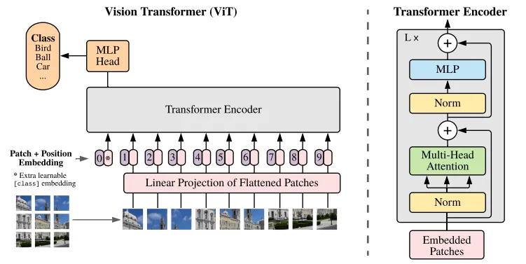

# 参考

网络结构讲解：https://zhuanlan.zhihu.com/p/445122996

补充了一些结构的细节：https://juejin.cn/post/7153427278054031391

代码来源：https://github.com/lucidrains/vit-pytorch

# 简介

ViT是2020年Google团队提出的将Transformer应用在图像分类的模型，虽然不是第一篇将transformer应用在视觉任务的论文，但是因为其模型“简单”且效果好，可扩展性强（scalable，模型越大效果越好），成为了transformer在CV领域应用的里程碑著作。

ViT 的主要创新在于将图像视为一系列像素块，类似于在自然语言处理中处理单词序列，从而能够使用标准的 Transformer 架构进行学习。

ViT原论文中最核心的结论是，当拥有足够多的数据进行预训练的时候，ViT的表现就会超过CNN，突破transformer缺少归纳偏置的限制，可以在下游任务中获得较好的迁移效果。随后的研究通过各种方法（如更有效的训练技巧、数据增强等）改进了其在数据较少的情况下的表现。

# 网络结构

ViT的结构如下图所示：

现在我们逐一解释各个部分。

> 顺带一提，对于已经在transformer中细致介绍过的部分，这里我可能会说得简略一些。

## patch embedding

在原初的transformer中，一个样本是一个句子转化而来的矩阵。为了使用这个结构，我们希望将图片分成很多小块，每个块好比一个单词，这些小块对应的向量堆叠成为输入矩阵。

具体来讲，我们会将图片分为一些固定大小的patch，patch的高宽可以指定。假设输入图片大小为224x224，patch大小为16x16，则每张图像会生成(224/16)^2=196个patch，即输入序列长度为196。而一个patch的形状是16x16x3，将它拉平成为一个16x16x3=768的向量。那么现在这张图片就转化成了196x768的矩阵。

根据原始图片大小的不同，这矩阵的大小也会有不同。我们得固定输入图片的大小，再辅以固定的patch尺寸，才能得到固定大小的输入。以下我们保留img_size=(224,224)、patch_size=(16,16)还有dim=768这些设定来继续讲解。

> 这里的词向量维数768是由patch尺寸决定的，但在看代码的时候我发现，还可以对输入矩阵进行一次线性变换，变换的输入维数是768，输出维数可以自由指定。也就是说实际得到的是196xdim的矩阵，dim可以人为控制。不过这个细节并不影响对结构的理解，接下来我们统一设定输入矩阵的列数为dim。

还有一点值得注意，我们还要手动添加一个代表“类别”的“词”向量进去，也就是说我们会使用一个维度为1xdim维的代表class token（或者说class patch）的向量来和196xdim的矩阵进行拼接操作，得到197xdim维的矩阵。这个class token向量是一个可学习的参数，初始为全1（这是参考代码写法，原论文未知）。关于为什么要引入它，我们会在后文解释。

ViT同样需要加入位置编码，这一操作和transformer中的完全相同。代码中显示位置编码的类型是可学习的位置编码，也即一个可变的197xdim矩阵。嵌入矩阵和位置编码矩阵相加作为模型输入，输入维度依然是197xdim。

## Transformer Encoder

输入的197xdim矩阵接下来会经过N个编码器。每一个编码器中进行的操作在网络结构图中已经指出。这一部分的操作与原初的transformer完全相同，所以这里不再详述。

我们关注一下过程中张量维数的变化：

- 经过LN层，维度依然是197x768
- 经过多头自注意力层，先将输入映射到Q、K、V，对于每一个头，QKV的维度都是197x768，将每个头的输出拼接起来，输出维度是197x (heads x dim)，然后然后通过一个线性变换变回197xdim
- 经过LN层，维度依然是197x768
- 经过MLP，中间可以有多个隐藏层，但最终输出的形状依然是197x768

可见每个编码器的输入输出形状都一样，这也保证了编码器可以直接堆叠。

## MLP Head

经过N个编码器后，得到的仍是197x768的矩阵，它可以看作是每个patch的编码结果。这时第一个行向量就是class patch转化来的向量，它应当蕴含着图片的类别信息。于是我们对它施以一个MLP，得到最终的分类结果。

特地加入一个class patch来计算结果，这一操作似乎有些刻意了，属于为了使用transformer而使用。能不能不加入这个，仅仅从图片本身那196x768的矩阵来计算分类结果呢？

自然也是可以的，通过实验表明，同样可以使用average pooling，对所有的tokens的输出做一个平均来得到用于预测的向量。原文ViT是为了尽可能是模型结构接近原始的Transformer，所以采用了类似于BERT的做法，加入特殊字符。

## 一些补充

关于positional encoding，其实有多种可行的方法。比如

- 1-D 位置编码：例如3x3共9个patch，patch编码为1到9

- 2-D 位置编码：patch编码为11,12,13,21,22,23,31,32,33，即同时考虑X和Y轴的信息，每个轴的编码维度是D/2

实际实验结果表明，不管使用哪种位置编码方式，模型的精度都很接近，甚至不适用位置编码，模型的性能损失也没有特别大。原因可能是ViT是作用在image patch上的，而不是image pixel，对网络来说这些patch之间的相对位置信息很容易理解，所以使用什么方式的位置编码影响都不大。