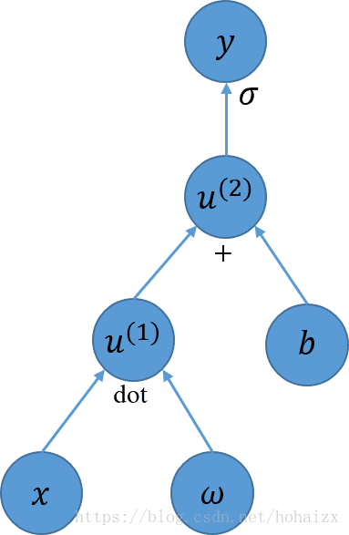

深度学习是一类方法的统称，这些方法解决的问题各种各样，其一致性在于，使用了神经元一般的多层网络，来将复杂的过程简化成多个简单过程。因此也可以把这些方法统称为神经网络。

# 基础知识

## 数据名词

在统计学中，一个输入数据集由很多条（行）向量（variable）组成，每个向量的分量实际上是自由变量的观测值（observation），这样一个数据集叫样本（sample）。（此处对“样本”的定义存疑。）

在机器学习中，将一条（行）向量称为样本（sample），或者实例（instance）、观测（observation）、输入向量（input vector）、特征向量（feature vector），其每个分量称为特征（feature）。

在训练模型时，训练集往往要反复使用多次，每一次用全部训练样本进行一次训练，就称一个纪元（epoch）。在每个纪元中，训练样本被分成多组，每次只用一组，一组就叫一个批次（batch），批次的容量（batch size）应该是训练样本总数除以批次数目。比如一共有$50000$条样本，共训练$10$纪，每一纪分$50$批训练，每一批次的容量都应该是$1000$。

特别的，批次数目仅为1（也即批次容量是全部训练样本数）时称为批次梯度下降（batch gradient descent, BGD）；批次容量仅为1（也即批次数目是全部训练样本数）时称为随机梯度下降（stochastic gradient descent, SGD）；批次数目与容量均不为1时称为微型批次梯度下降（mini-batch gradient descent）。

## 梯度传播的实现

梯度方向是函数上升最快的方向，使自变量沿着负梯度方向移动，就可以令函数值减小。如果用损失函数来评价模型的优劣，损失函数值越小就说明模型越好，那么我们需要让模型参数移动到某个最优解，使得损失函数值最小。

为了获取最优的模型参数$w$，我们需要用最终的损失函数$loss$对$w$求导，求出的导数（梯度）$\nabla_{loss}$应该是与$w$同形状的向量（矩阵、张量），这之后更新$w$为$w-\alpha\nabla_{loss}$，以此迭代得到最优的$w$。

为了实现上述的梯度下降法，我们总是需要求出$loss$对$w$的导数。从$w$算到$loss$会经过很多步骤，可以用链式法则来递归或者迭代地计算出全部中间变量的梯度，进而获取最终结果$loss$关于最初变量$w$的梯度。这一过程称为反向传播算法。

为了理解反向传播的过程，可以用计算图来可视化从输入到输出的结构。

有了计算图，就容易根据链式法则确定$y$关于$x$的导数如何分步骤计算。

为了实现反向传播算法，我们首先按照计算图正序，从各个叶子结点算出全部节点的值，这一过程叫前向传播。之后，沿着计算图从上往下，依次算出每个节点关于其邻接节点的导数（梯度），这之后立刻根据链式法则更新最终结果$y$关于该节点的邻接节点的梯度。如此一路延伸，最终就可以算得$y$关于叶子结点的梯度。每个节点保存下来的梯度，都是$y$关于其值的梯度。这一过程叫反向传播。

在实际中，由于输入输出都是数组，也即函数都是向量值函数而非一元函数，所以求出来的导数会有雅可比矩阵，乃至更高维数的张量。这在编写程序上是很难实现的，为了解决这个问题，我们规定，只能直接实现标量对张量的求导。这样一来，标量对张量的导数，就是由对分量的导数所形成的一个同维的张量，这是容易做到的。

然而，在计算过程中，难免会有张量形式的中间变量，张量对张量求导是难以避免的。为了在这种情况下依然能求出最终的标量对初始张量的导数，实际程序中求张量对张量的导数时，需要给出一个与自变量同形状的张量$v$作为参数，输出的则是这个参数与“张量对张量导数”的乘积。具体细节可以参考以下的例子。

>设$l=f(y),y=g(x)$，其中$l$是标量，$y=(y_1,...,y_m)^T$是$m$维向量，$x=(x_1,...,x_n)^T$是$n$维向量。为求出$\frac{\part l}{\part x}$，首先应该求出$\frac{\part l}{\part y}$与$\frac{\part y}{\part x}$。
>
>理论上我们知道，求出来的结果应该是
>$$
>\frac{\part l}{\part y}=(\frac{\part l}{\part {y_1}},...,\frac{\part l}{\part {y_m}})^T \\
>\frac{\part y}{\part {x}}=
>\begin{pmatrix}
>\frac{\part {y_1}}{\part {x_1}} & \cdots & \frac{\part {y_1}}{\part {x_n}}\\
>\vdots & \ddots &\vdots \\
>\frac{\part {y_m}}{\part {x_1}} & \cdots & \frac{\part {y_m}}{\part {x_n}}\\
>\end{pmatrix}
>$$
>所以
>$$
>\frac{\part l}{\part x}=\frac{\part l}{\part y}\frac{\part y}{\part x}=
>\begin{pmatrix}
>\frac{\part l}{\part {y_1}} \\ \vdots \\ \frac{\part l}{\part {y_m}}
>\end{pmatrix}
>\begin{pmatrix}
>\frac{\part {y_1}}{\part {x_1}} & \cdots & \frac{\part {y_1}}{\part {x_n}}\\
>\vdots & \ddots &\vdots \\
>\frac{\part {y_m}}{\part {x_1}} & \cdots & \frac{\part {y_m}}{\part {x_n}}\\
>\end{pmatrix}
>=\begin{pmatrix}
>\frac{\part {l}}{\part {y_1}}\frac{\part {y_1}}{\part {x_1}}+\cdots+\frac{\part {l}}{\part {y_m}}\frac{\part {y_m}}{\part {x_1}} \\
>\vdots \\
>\frac{\part {l}}{\part {y_1}}\frac{\part {y_1}}{\part {x_n}}+\cdots+\frac{\part {l}}{\part {y_m}}\frac{\part {y_m}}{\part {x_n}} \\
>\end{pmatrix}
>$$
>需要说明的是，在上式中，矩阵相乘的方向并不对，缺少了一些转置符号。但是由于更高张量的求导本身就是高维数组，其方向可以任意的人为规定，所以总能通过规定写法，来使得表达式中不需要转置。所以此处略过方向上的细节，会意即可。
>
>由此可见，如果我们不想写出高维的$\frac{\part y}{\part {x}}$，又要计算出$\frac{\part l}{\part {x}}$，只要把$\frac{\part l}{\part {y}}$传递给$y$，直接通过$\frac{\part l}{\part {y}}$和$y=g(x)$来计算出结果$\frac{\part l}{\part {x}}$即可。体现在程序上，就是将$\frac{\part l}{\part {y}}$作为一个参数，在计算$$\frac{\part y}{\part {x}}$$时传递给计算用的函数Func，让这个Func直接返回$\frac{\part l}{\part x}$。
>
>为了方便理解，可以这样看待：在计算张量$y$对张量$x$的梯度（导数）时，函数Func需要接收一个与$y$形状相同的参数（实际上是最终目标$l$关于$y$的导数），记为$v$，在计算出导数$J=\frac{\part y}{\part x}$后，Func实际返回的是$v$与$J$的乘积。
>
>更进一步，可以把$J$看作是$(\frac{\part {y_1}}{\part x},\frac{\part {y_2}}{\part x},...,\frac{\part {y_m}}{\part x})$，也即是一个与$v$、与$y$都同形状的“向量”，其每个“分量”都是标量对$x$求导，因而也是与$x$同形状的张量。所谓的“$v$与$J$的乘积”，实际上是二者的对应项相乘再求和，得到的还是与$x$同形状的张量。

# 多层感知机/前馈神经网络

### 思路

多层感知机（Multi-Layer Perception, MLP）多被用作函数逼近器。也即，我们已知了函数$y=f(x)$的许多点$(x_i,y_i)$，希望把函数给拟合出来。这里的函数未必是连续的，比如分类问题也可以看做是将特征$x$映到类别$y$。

多层感知机由多层函数复合而来，结构如下图

其中的$x_i$是输入的特征，称为输入层；$y$是目标，称为输出层；每个$f_i^{(j)}$代表了一次函数作用（也可以看做是向量值函数作用于上一层的向量，得到了这一层的向量。比如上图第一层就是$f^{(j)}$这个向量值函数作用于$x=(x_1,x_2,x_3,x_4)$得到了$f^{(1)}(x)=(f_1^{(1)},f_2^{(1)},f_3^{(1)})$），称为（第$j$）隐藏层。可以看到，每一层都与上一层的全部节点连接，所以这称为全连接的（神经网络）。

在多层感知机中，每层的函数$f^{(j)}$都是线性函数与一个非线性函数$\phi$（称为激活函数）的复合，而输出层是隐藏层的函数，这个函数根据输出的类型来决定，在细节部分会详细说明。假设上图中的输出层是线性输出单元，那么每一层之间的关系即为
$$
\begin{align}
f^{(1)} &= \phi(W_1 x+b_1) \\
f^{(2)} &= \phi(W_2 f^{(1)}+b_2) \\
y &= W_3 f^{(2)}+b_3
\end{align}
$$
在这个模型中，参数包括了隐藏层的数目（网络深度）$h$、隐藏层的单元数（网络宽度）$w_1,...,w_h$、线性变化的系数（权重）$W_1,...,W_h$、线性变换的截距项（偏置）$b_1,...,b_h$，以及激活函数$\phi$。我们通过最小化损失函数，来求得最优的参数。

### 细节

#### 激活函数

激活函数是非线性函数，它的存在使得神经网络是非线性模型。常用的激活函数有Sigmoid函数（也叫Logistic函数）

$$
\sigma(x)=\frac{1}{1+e^{-x}}
$$
双曲正切函数
$$
\tanh (x)=2\sigma(2x)-1=\frac{e^x-e^{-x}}{e^x+e^{-x}}
$$
ReLU函数（Rectified Linear Unit，线性整流函数，或者修正线性单元）
$$
f(x)=\max\{0,x\}=\begin{cases}
0, & x\leqslant0 \\
x, & x>0 \\
\end{cases}
$$

#### 输出单元

假设最后一个隐藏层的输出是$h=(h_1,...,h_m)'$，我们还需要设定合适的函数将它变成目标输出$y$。常见的有以下选择

1. 线性输出单元/连续输出。目标特征是连续型变量时，直接用线性变换
   $$
   y=W^Th+b
   $$
   来计算$y$，$W^T$与$b$都是需要确定的参数。

1. S形输出单元/二分类输出。若目标特征是二分类的，仅取值$0$或$1$（也可以理解为需要计算的是$y=0,1$的概率，再根据概率手动分类），则用Sigmoid函数计算
   $$
   p(y=0|x)=\frac{1}{1+e^{z}} \\
   p(y=1|x)=\frac{e^{z}}{1+e^{z}} \\
   $$
   其中$z=W^Th+b$是最后隐藏层的线性组合。

1. Softmax输出单元/多分类输出。若目标特征是多分类的，不妨设为取值$1,2,...,k$（也可以理解为需要计算的是$y=1,2,...,k$的概率，再根据概率手动分类），则用Softmax函数计算概率
   $$
   p(y=i|x)=\frac{e^{z_i}}{\sum\limits_{i=1}^k e^{z_i}},\ i=1,2,...,k
   $$
   其中$z=(z_1,...,z_k)'=W^Th+b$是最后隐藏层的线性组合。

#### 损失函数

为了得到合适的参数，需要针对拟合出来的$\hat y=(\hat y_1,...,\hat y_n)$定义损失函数来衡量参数的优良程度。常用的有

1. 负对数似然函数。要计算对数似然函数，需要已经得到模型的分布$f(y|x)$，负对数似然函数即为
   $$
   L(\theta)=-E(\ln f(y|x))
   $$
   其中的$x,y$代入真实数据，而分布$f(y|x)$会包含拟合值$\hat y$。当模型分布与真实数据的分布越接近，则$f(y|x)$就越大，$L(\theta)$就越小，这符合我们“最小化损失”的目的。比如，采用正态分布$ y\sim N(f(x,\theta),I)$作为模型（这其中的$f(x,\theta)$就是拟合值$\hat y$），负对数似然函数即为均方误差MSE，也即有

$$
L(\theta)=\frac{1}{2n}\sum_{i=1}^n \|y_i-\hat y_i\|_2^2
$$

2. 交叉熵。对于（二或多）分类问题，假设目标$y$可取的类别为$c_1,c_2,...,c_k$，我们每次预测$\hat y_i$都需要计算出它属于各个类的概率$p(\hat y_i\in c_k)$，常采用交叉熵
   $$
   L(\theta)=- \frac1n \sum_{i=1}^n \sum_{j=1}^k I[y_i\in c_j]\log_2(p(\hat y_i\in c_j))
   $$
   来衡量这次预测的好坏程度。即使预测结果完全相同，以更大概率选到正确结果的参数组合，其交叉熵也会更小。

# 卷积神经网络及其拓展

## 卷积神经网络CNN

卷积神经网络（Convolutional Neural Network, CNN）专门用来处理具有网格结构的数据（比如图像，时间序列）。其主要结构包括输入层、卷积层、激活层、池化（Pooling）层和全连接层（有时把卷积、激活、池化合起来称为卷积层，有时则把池化和激活合起来成为卷积层，需要根据语义判断）。下图是一个例子

图中每一层的数据都是二维的，为了方便，将它们都看作是图片。分别用高、宽描述图片的大小，而每一层会得到一张图片的多个二维特征，将其数目称为深度或者通道数。

卷积和池化是为了提取特征，之后的全连接层则是利用提取出的特征完成目的。

#### 卷积

这里的卷积特指二维卷积。每一次卷积操作，会将网格状的数据（图片、矩阵），通过加权平均的方式转变成一组更小的网格状数据。具体来说，假设输入矩阵$I$是$n\times n$规模的，找一规模远小于$n$的权重矩阵（也叫核函数、滤波器等）$K$依次与$I$的同阶子矩阵作“乘法”（并非矩阵乘法，而是更像内积——对应元相乘后求和），得到新的数据。与$I$的每个子矩阵都如此运算，就得到新的矩阵$S$。计算出的矩阵$S$也叫特征映射（feature map）。$K$的规模可以叫感受视野（receptive field），而滑动的格数则是步长，实践中往往要选择合理的步长与视野才能保证卷积的顺利进行。下图是一个简单的例子：

这一过程也可以叫滤波。

卷积操作实际上相当于一个非全连接的隐藏层，非全连接意味着参数减少；而反复使用同一个核$K$也使得参数变少。此外，由于卷积是加权平均，所以对$I$的平移操作不影响卷积的结果，这称为卷积具有等变表示效果。

事实上，一张图片的每个像素点不止一个数，而是$m$元组（$m$称为输入通道数），代表了RGB色彩值等描述单像素点的向量。所以一个图片是一个三维张量，这也意味着滤波器$K$需要有$m$个，才能对每个通道下的图片进行卷积。

更事实上，一个卷积层应该提取出一张图片的多个特征。这表示一个卷积层应该对图片进行多次（具体次数$h$是一个参数，称做卷积层深度、输出通道数）卷积操作，得到的多张“图片”$S_1,...,S_h$（每个都是二维矩阵）。每个输出通道$j$，在每个输入通道$i$下，都计算出一个矩阵$S_{i,j}$，全部输入通道的结果相加就是输出通道的结果$S_j$。可以想见，每个$S_{i,j}$的长宽应该是$s=n-k_n+1$，其中$k_n$是滤波器$K$的边长。

总而言之，一次卷积，实际上是将$n\times n\times m$的图片张量，通过$m\times h$个卷积核的作用，变成了$s\times s\times h$的隐藏层张量。也可以理解为，将三维的输入张量，通过三维的卷积核作用，变成了三维输出张量。如下图：

> 以上描述了最普通的卷积操作，实际上还有一些改进：
>
> 针对输出的第$i$个通道，计算输出时，可以加上统一的偏置（bias）值$b_i$。
>
> 当$I$的规模$n$无法整除$K$的规模$m$时，通常在$I$周围补充一些$0$来使得可以整除，这叫做零填充或同等填充（same padding）。也可以删除$I$的边边角角，这叫做有效填充。
>
> 卷积核$K$可以是稀疏的矩阵，这意味着矩阵中的元与元之间，均匀地间隔着一些$0$，在卷积时，图片像素会跳跃着参与卷积。这可以称为卷积核的扩张（dilation）。不扩张的卷积核看作扩张程度为$0$。扩张后的卷积核边长实际上是$k_n+\text{dilation}*(k_n-1)$。
>
> 移动卷积核时，未必每次只滑动一格，滑动步长stride可以是更多。此时输出矩阵的长宽应该是$(n-k_n+1)/\text{stride}$。在使用多步滑动时，要注意控制输入的长宽，保证能够整除。

激活层则对每个矩阵的每个元都使用激活函数，比如ReLU函数，所得到的仍是结构相同的多个矩阵。

#### 池化

池化，指的是将多张图片$S_1,...,S_k$在保留某些信息的前提下压缩，以减少空间。具体操作是，对于$n\times n$规模的输入矩阵$I$，设定一个较小的感受视野（不妨设为$h\times h$），在这个视野将窗口按照选定的步长$d$在$I$上滑动，得到很多小矩阵，每个小矩阵根据一个池化函数给出一个值，这就构成了一个新的、比原来小的矩阵。

为了方便计算长度，通常令$h=d$可以整除输入矩阵的边长，这样一来，输出的每个小矩阵，其边长应该是$n/d$。这个移动的感受视野也可以看做是滤波器。

常用的池化函数有最大值、均值、$2$范数等等。下图是一个最大化池化的例子：

可以想见，池化不改变卷积层输出的深度，只是减少宽和高。

#### 全连接

完成多次卷积+池化之后，原本的多张图片变成了一系列矩阵，将这些矩阵拉直成为向量，之后便可以按照多层感知机的方式，全连接形成网络。

假设卷积和池化全部完成之后，得到的是$N$个$o\times s\times s$的矩阵，那么第一个全连接层的输入长度就是$os^2$，这之后的隐藏层长度随意。而最后一个线性层的输出长度，应该与类别数一致，再经过softmax函数，得到的值含义便是归入各个类别的概率。

## 一维卷积神经网络

一维卷积神经网络，希望将用于图像的处理方法用到一维序列上来。这其实只需要将二维卷积变成一维卷积。

对于一个序列，卷积操作实际上就是在该序列上设置滑窗，卷积核每次只与滑窗内的部分对应相乘。

在二维卷积神经网络中，输入的实际上是$N$个三维张量（通道数×长×宽），而一维卷积神经网络中，输入的则是$N$个矩阵也即二维张量（通道数×序列长度）。对于文本类数据，长度实际上是单词个数，通道数是单词长度；对于时间序列，通道数就是$1$了。

与二维卷积相同，针对每一条输入，卷积通常不只进行一次，也即输出的通道数不止是$1$。在实际操作中，其实是多个（输出通道数个）矩阵形状的卷积核（输入通道数×卷积核长度），在矩阵形状的输入（输入通道数×序列长度）上左右滑动，每个卷积核给出一个长度为“序列长度-卷集合长度+1”的向量，一共有输出通道数个，组成新的矩阵作为输出。

# 循环神经网络极其拓展

循环神经网络（Recurrent Neural Network, RNN）是一类用来处理“序列”数据的神经网络，它的神经元可以接收同层的信息，可以看做同一层的神经元之间也存在序列关系，在先的会影响在后的。这是有意义的，一个简单的例子是文本分析，在分析“我/吃/苹果”这句话的词性时，如果知道了“吃”是动词，那么“苹果”是名词的概率将大大增加。

## 循环神经网络RNN

### 思路

循环神经网络的结构可以参考下图

其中的$x_t$是输入，$s_t$（也可记为$h_t$）是隐藏层的状态，$o_t$是输出，$U,W,V$是变换时的系数（权重）矩阵。此外还有偏置$b_h,b_o$，激活函数$\phi_h,\phi_o$这些参数。在循环神经网络中，只有一个隐藏层，不过实际上也可以把这一层的每个神经元都看成一层，毕竟它们会产生可传递的影响。

具体来说，在每个时刻$t$，传入参数$x_t$，该时刻的隐藏层状态将会更新为
$$
h_t=s_t=\phi_h(Ux_t+Wh_{t-1}+b_h)
$$
该时刻的输出为
$$
o_t=\phi_o(Vh_t+b_o)
$$
接下来就是寻找最优参数的问题了。

## 长短期记忆网络LSTM

长短期记忆（Long Short Term Memory）网络是RNN的改进，它不仅可以接收上一时期的数据影响（短期记忆），也可以受很多时期之前的数据影响（长期记忆）。这同样很有意义，比如分析“the clouds are in the sky”时，clouds对预测sky的作用很大，而它们并不是紧挨着的。

以下思路讲解来自https://colah.github.io/posts/2015-08-Understanding-LSTMs/。翻译可以查看https://zhuanlan.zhihu.com/p/104475016与https://www.cnblogs.com/xuruilong100/p/8506949.html。

### 思路

LSTM的图解如下：

图中的A可以对标RNN中用$x_t$计算$s_t$的过程，而在LSTM中，不再是一次计算得出唯一的$s_t$，而有多个隐藏在其中的神经元。图中的A之间有两条箭头，上面的就代表了长期记忆，它被保存在单元状态$C_t$中；下面的则是短期记忆，保存在隐藏状态$h_t$中。

（原博文讲解地非常清楚，我若转述，只能照搬原文，故这一部分暂不继续写下去）

在实际中，往往会叠用多个LSTM网络，将某一层的输入作为下一层的输出，再次运算得到新的输出，以此类推，来增强拟合程度，如下图：

由此，我们知道，实际上的隐藏状态（或曰单次输出）$h_t$与单元状态$C_t$都应该是二维的。我们最终得到的输出，实际上是隐藏状态的最后一层。

总结一下LSTM中的变量以及数组形状：

- 网络超参数有输入通道数、输出通道数、叠用层数

- 输入的形状是 批次容量×序列长度×输入通道数
- 输出的形状是 批次容量×序列长度×输出通道数
- 隐藏状态、单元状态的形状是 叠用层数×序列长度×输出通道数

## 门控循环网络GRU

GRU网络是LSTM的变式，相比LSTM，它取消了单元状态，细胞之间只传递隐藏状态，而且只有两个门：更新门和输出门。更新门同时进行了遗忘与记忆的操作。结构图与计算公式如下

其中，$h_t$是隐藏状态，$r_t$是新学到的信息，$z_t$是权重，$\tilde h_t$是新学到的记忆。点号是矩阵乘法，星号是逐元素相乘也即Hadamard乘积。

与LSTM相同，GRU网络也可以堆叠多层，每一层的隐藏状态作为下一层的输入。为了提升泛化能力，还会在传递中随机选择一些隐藏状态置零。